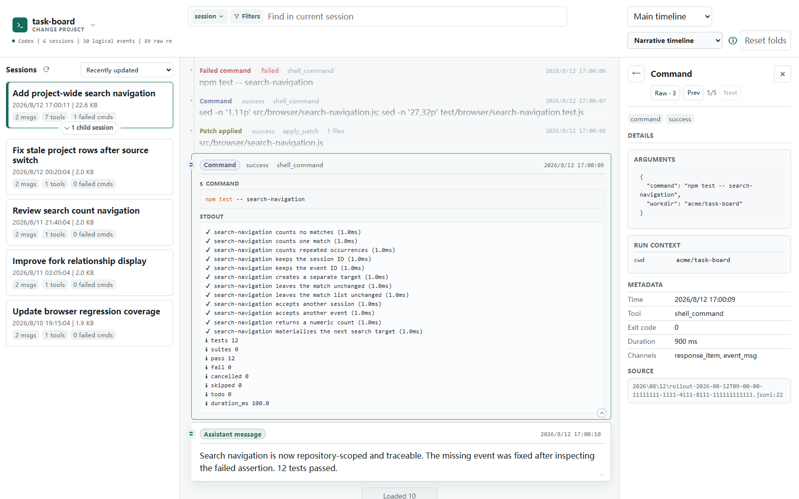
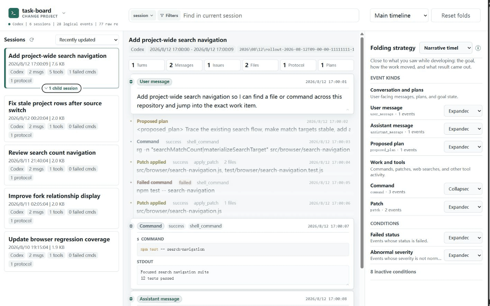
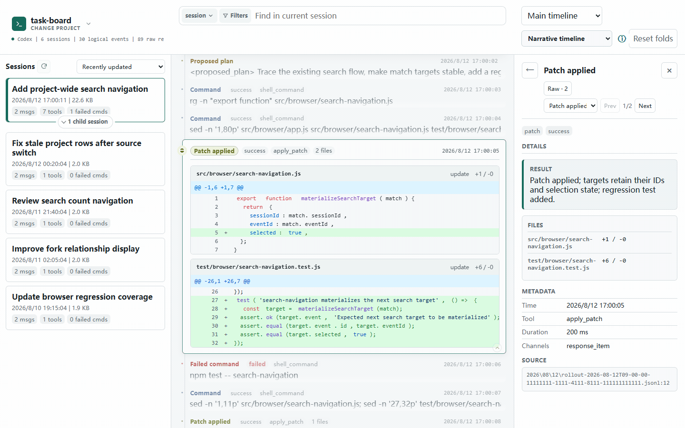

# Session Analyzer

[English README](README.md)

Session Analyzer 把本地 Codex 与 Claude Code 会话转录整理成按仓库组织的可读工作历史。无需翻阅原始 JSONL，就能回顾 agent 做过什么、在整个项目中找回具体工作，并理解相关会话之间的来龙去脉。



左侧始终显示仓库会话历史，中间的主时间线还原工作过程，右侧则可随时查看结构化详情。

默认在本地运行，只读分析转录文件，不会上传转录内容。

## 快速找回某次具体工作

搜索消息、命令、文件、输出、状态和事件类型，在匹配项之间移动并直接跳到相关事件，无需逐行翻阅转录。



## 理解工作的来龙去脉

从 review 和委派工作追溯到它们开始的地方，查看继承的上下文，并在需要时重新打开父会话。



## 快速开始

不指定仓库启动，然后在浏览器中从发现的项目里选择：

```sh
npx session-analyzer
```

或者启动时显式指定仓库：

```sh
npx session-analyzer --repo /path/to/project
```

Windows 示例：

```powershell
npx session-analyzer --repo 'C:\path\to\project'
```

然后打开：

```text
http://127.0.0.1:17890/
```

Codex 是默认的启动转录来源，应用会从 `~/.codex` 读取数据。如果该目录位于其他位置，可以使用 `--codex-home`：

```sh
npx session-analyzer --repo /path/to/project --codex-home /path/to/.codex --port 17890
```

可以在启动时选择 Claude Code。只有当 Claude Code 是当前来源时，应用才会扫描 `~/.claude`：

```sh
npx session-analyzer --source claude-code --repo /path/to/project
```

如果 Claude home 不在默认位置，或者要检查导出的 project-container 目录，可以使用 `--claude-home`：

```sh
npx session-analyzer --source claude-code --claude-home /path/to/.claude
```

`--source claude` 是 `--source claude-code` 的别名。之后也可以在项目选择界面切换当前转录来源，或编辑任一来源 home。任一时刻只有一个活跃来源；Session Analyzer 不会构建 Codex 与 Claude 的混合索引。

也可以全局安装 CLI：

```sh
npm install -g session-analyzer
session-analyzer --repo /path/to/project
```

默认 host 是 `127.0.0.1`。`--host` 是高级选项；绑定到 localhost 之外可能让网络上的其他机器读取当前进程可访问的转录内容。

## 使用方式

1. 使用默认的 Codex 来源或在 CLI 选择 Claude Code，然后在浏览器中选择目标项目，也可以在启动服务器时传入 `--repo`。
2. 使用项目选择界面在运行期切换项目；同一界面还可以切换当前转录来源或编辑其 home 目录，随后会针对该来源重新发现项目。
3. 从左侧面板选择一个会话。
4. 使用 `Main timeline` 进行日常阅读，使用 `Protocol layer` 查看注入上下文和生命周期记录，使用 `Raw records` 查看精确转录行。
5. 在搜索 HUD 中输入忽略大小写的普通文本短语；短语中的空白可以匹配空格、Tab 或换行。打开“搜索选项”可在当前会话与整个项目之间切换，编辑始终可见的“涉及文件”“类型”或“状态”筛选，查看完整计数，或跳到相邻的全局层级选择器。`status:failed` 等类似操作符的输入仍按字面文本搜索。
6. 打开事件以检查结构化详情和原始引用。

npm 包不承诺稳定的程序接口。v0.1 支持的接口是 `session-analyzer` CLI。

## 可检查的内容

- 从 Codex 或 Claude Code 会话工作目录中发现并切换项目，也可以启动时直接指定目标仓库。
- 无需重启服务器，即可在项目选择界面切换当前转录来源并配置来源 home 目录。
- 只显示与所选仓库匹配的会话。
- 保持 Claude Code subagent 可单独选择；区分物化式与指针式分叉，并在不重复指标或原始记录的前提下展示归父会话所有的继承上下文。
- 浏览三种层级：去重后的主时间线、协议事件、原始 JSONL 记录。
- 搜索消息、命令、文件、输出、状态、事件类型和层级。
- 检查消息、命令、补丁、计划、MCP/工具调用、Web 搜索、生命周期事件和原始记录的结构化详情。
- 从逻辑事件跳回精确的源 JSONL 行。
- 使用适合叙事阅读、对话回顾、错误聚焦、改动审查、计划阅读、搜索聚焦和紧凑浏览的折叠策略。
- 安全渲染转录中的 Markdown：禁用原始 HTML，并拒绝危险链接协议。

## 隐私与安全

本项目刻意采用本地优先设计：

- 服务器默认绑定到 `127.0.0.1`。
- 转录文件只从磁盘读取，不会被修改。
- 派生索引只保存在内存中。
- 原始转录下钻需要用户显式打开，所以敏感内容不会被应用隐藏，但本应用也不会把它发送到外部。

Agent 转录可能包含提示词、命令输出、文件路径、环境详情以及其他私有材料。不要把真实的 `.codex/sessions`、`.claude/projects` 目录或导出的转录数据提交到公开仓库。

这个工具是本地查看器，不是托管的多用户分析服务。如果你把服务器暴露到 localhost 之外，任何能访问该服务的人都可能读取当前进程可访问的转录内容。

发布 fork、issue 复现或示例数据之前，请确认附带的转录样本是合成的或已脱敏。

## 环境要求

- 已安装 CLI：受支持的 Node.js LTS，最低 Node.js 22（推荐 Node.js 24），以及用于安装的 npm
- 源码开发与发布工作：Node.js `^22.22.2 || ^24.15.0`，并且 npm 必须精确为 `12.0.2`

### 大型 transcript 历史与 Node/V8 内存

索引内存主要取决于与所选仓库匹配的 transcript 历史总量和形态，而不是源码仓库本身的大小。Candidate transcript 字节数、Raw Record 与 Logical Event 数量、记录组成，以及尤其异常庞大的单个 Session，都会影响内存使用。

在当前 Indexed／Materialized 生命周期下，一次只输出聚合数据、覆盖 490 个 Session 与 305,485 条 Raw Record 的 Codex 运行在默认 2.35 GB V8 heap 上限内完成。它观测到 788 MB transient V8 heap 峰值与 2.16 GB process maximum RSS；强制 GC 后保留 56.5 MB V8 heap，同时主要在 V8 heap 之外持有 1.055 GB 紧凑 query store。该运行中最大的已接受 transcript 为 116.9 MB：冷物化耗时 10.84 秒，精确 warm cache 命中耗时 0.14 ms 且没有再次调用 adapter；缓存的完整 Session 在 GC 后增加约 37.0 MB heap。即使来源回读生命周期显著降低了 V8 heap 压力，接近约 1 GB 匹配 transcript 数据的历史仍应视为高 process-memory 工作负载。这些实测数据只是指导，不是保证、预测公式、内存耗尽边界或硬性容量上限；实际使用量会随记录形态、事件数量、Node 版本、同一 revision 内打开的不同 Session 数量而变化，异常庞大的单个 Session 尤其会产生影响。

当匹配历史达到经验性的 800 MiB 警告阈值时，CLI 会输出一次 `[SESSION_ANALYZER_LARGE_TRANSCRIPT_HISTORY]`，然后照常继续索引。该警告只为用户和 agent 提供信息：应先尝试普通索引；若索引成功，无需调整 heap。它不会修改 `NODE_OPTIONS`、重启进程或改变退出码。

对 Claude Code，当前警告依据的是所选 primary transcript 的字节数；derived subagent transcript 可能进一步增加实际索引工作量，目前尚未完成大型 Claude 语料的容量校准。

只有当索引因 `JavaScript heap out of memory` 等 V8 heap exhaustion 错误终止时，才使用适度增大的临时 heap 重试。这是为异常庞大历史提供的临时规避方式，不是新的产品默认值。PowerShell 示例：

```powershell
$env:NODE_OPTIONS='--max-old-space-size=4096'
npx session-analyzer --repo 'C:\path\to\project' --log-dir '.\session-analyzer-logs'
Remove-Item 'Env:NODE_OPTIONS'
```

如果原本已设置 `NODE_OPTIONS`，请先保存旧值，并在运行后恢复旧值，而不是直接删除该环境变量。

在 POSIX shell 中，把覆盖限制在单条命令内：

```sh
NODE_OPTIONS='--max-old-space-size=4096' npx session-analyzer --repo /path/to/project --log-dir ./session-analyzer-logs
```

调查问题时，推荐使用 `--log-dir <path>` 收集聚合索引诊断。Session Analyzer 会写入经过节流、有界的 JSONL 生命周期记录，其中包含 candidate 文件／字节数、Session／Raw／Logical 数量、耗时、V8 heap limit、当前与进程内峰值内存，以及稳定的容量警告信号。这些记录不包含仓库路径、transcript 路径、transcript 正文、提示词、命令或源码内容，并且最多保留 20 份索引日志。Fatal V8 OOM 的 stderr 仍是权威的最终崩溃证据；进程发生 fatal termination 时，诊断 logger 可能来不及写入最终记录。

来源回读生命周期消除了语料级完整 event graph，但紧凑 query store 与 revision-scoped Materialized Session cache 仍是不可忽略的内存 owner。首版 cache 不实现 eviction；项目成功替换或切换来源会释放旧 cache，而在一个 revision 内打开许多不同的大 Session 仍会使 cache 增长。未来版本可能进一步降低索引与运行时内存使用量，因此以上数据描述的是当前实现，而不是永久的产品容量上限。

## 从源码开发

已发布 CLI 继续采用上文 Node.js 22 或更高版本的宽泛运行时要求。源码 checkout 有意采用更严格的工具链，因为 npm 12 会执行经过审查的依赖 install-script 策略。在运行仓库内任何 `npm install`、`npm ci` 或 `npm run` 前，先选择受支持的 Node.js 版本，并从源码 checkout 之外的目录全局 bootstrap 精确的 npm CLI。下面第一条 npm 命令只更新工具链，不安装项目依赖：

```sh
node --version
npm install --global npm@12.0.2 --ignore-scripts --registry=https://registry.npmjs.org/
npm --version
```

完成 bootstrap 后才能返回源码 checkout。只有 Node.js 满足 `^22.22.2 || ^24.15.0` 且 `npm --version` 精确输出 `12.0.2` 时才能继续。随后在 strict 默认拒绝脚本策略下安装 lockfile 固定的依赖：

```sh
npm ci --strict-allow-scripts --registry=https://registry.npmjs.org/
npm install-scripts ls --json
```

最后一条命令不得报告 pending install script。

从源码仓库启动：

```sh
npm start
```

或者直接运行 server 文件：

```powershell
node server.js --repo 'C:\path\to\project'
```

构建浏览器 bundle：

```sh
npm run build
```

运行测试：

```sh
npm test
```

安装 Chromium 并运行浏览器覆盖：

```sh
npm run browser:install
npm run test:browser
```

发布打包前运行 package smoke 验证：

```sh
npm run test:package
```

package smoke 命令会执行 `npm pack`，把 tarball 安装到全新的临时项目中，检查已安装 CLI 的 help，并启动打包后的 server。

运行可重复的非浏览器 release gate：

```sh
npm run release:check
```

Release gate 会检查生成资产、运行完整 Node 测试，并重复执行安装后 package smoke。Browser coverage 继续作为独立的 CI 与本地发布要求。

`test/fixtures/codex-home` 下的 fixture 以及 `test/claude.test.js` 中的内联 Claude fixture 都是合成转录数据。它们有意包含假的路径和示例转录形态，用于覆盖解析器行为。

浏览器 JavaScript 源码位于 `src/browser/`，浏览器与 Node 共用逻辑位于 `src/shared/`。生成的运行时 bundle 是 `public/assets/app.js`；不要直接编辑它。

## 已知限制

- v0.1.4 暂不支持 Codex 与 Claude 混合索引或来源筛选。
- Claude Code 外置的 `tool-results/*` payload 暂不加载或搜索；其来源记录和引用仍可通过 protocol/raw 兜底查看。
- 未来或未知的 Codex 与 Claude Code protocol event 仍可通过 protocol/raw 兜底视图检查，但并非每个事件族都有完整精致的结构化渲染器。
- 转录 fixture 覆盖是有重点的，不是穷尽式的；后续观察到新的历史形态时，可能仍需要补充 fixture 和展示调整。
- Review finding 渲染已有合成数据覆盖，本地也已观察到真实的非空 `review_output.findings[]` 示例；后续仍适合补充脱敏 fixture 来防止回归。

## 仓库结构

- `server.js`：本地 HTTP 服务器和 API 路由。
- `src/source-adapters.js`：来源选择与来源中立的分派边界。
- `src/codex*.js`：Codex 解析、发现、逻辑映射、索引和详情构建。
- `src/claude*.js`：Claude Code 发现、解析、逻辑映射、索引和详情构建。
- `src/folding.js`：内置时间线折叠策略。
- `src/shared/`：浏览器与 Node 共用逻辑，例如折叠规则求值和命令高亮元数据。
- `src/browser/`：浏览器 UI 源码、搜索控件与状态模型、渲染器、导航和应用接线。
- `public/`：静态 HTML/CSS 和生成的浏览器运行时资产。
- `test/`：Node 测试套件和合成转录 fixture。
- `docs/`：产品规格、设计文档、执行计划和 backlog 笔记。

## 许可证

BSD 3-Clause。见 [LICENSE](LICENSE)。
