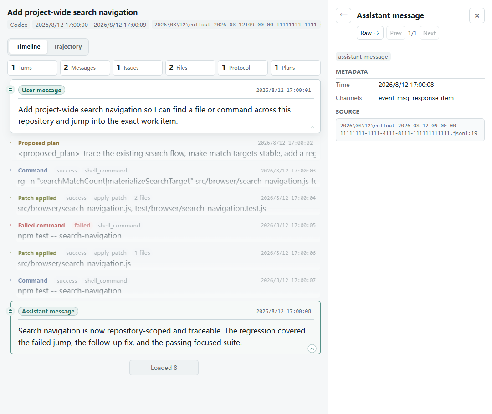
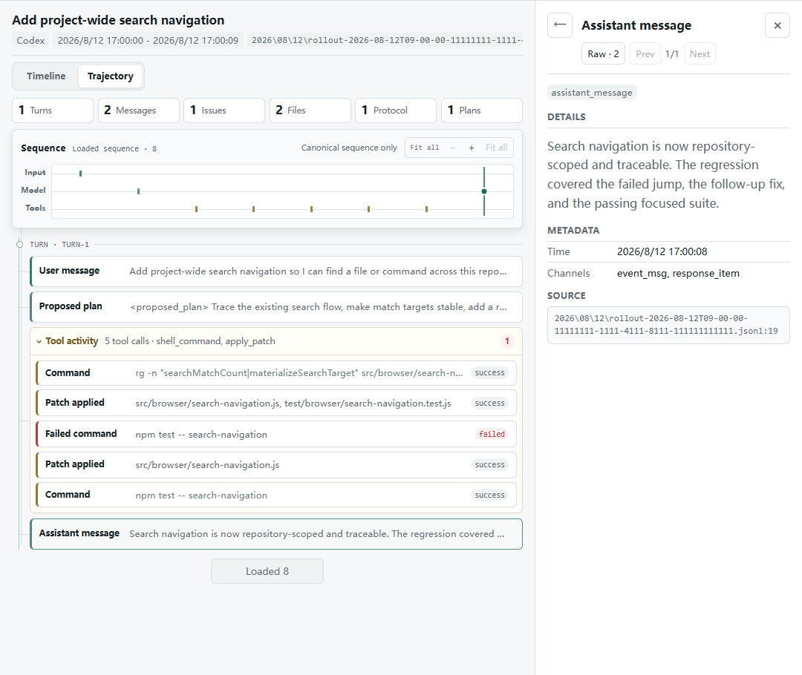
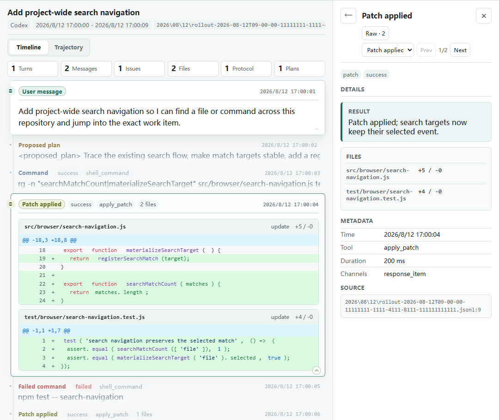
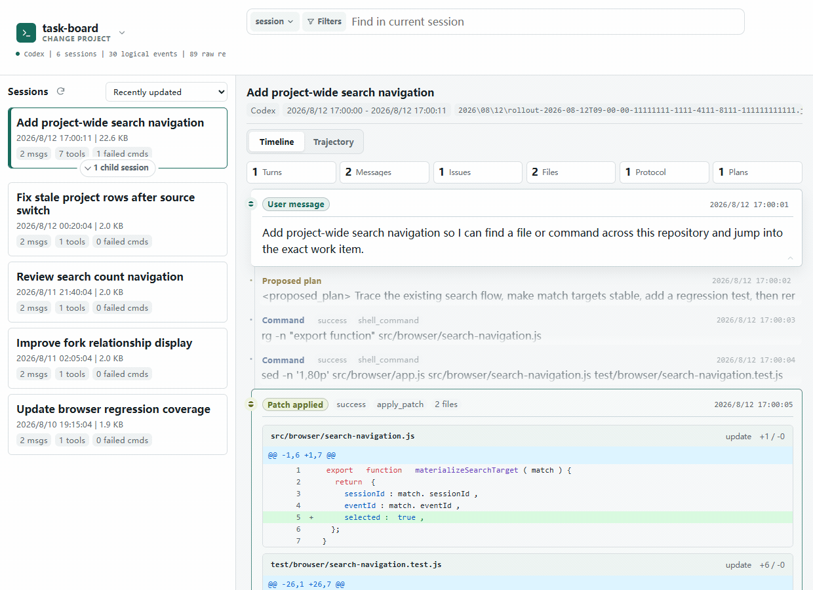

# Session Analyzer

[English README](README.md)

**Codex、Claude Code 与 DeepSeek Harness 的本地会话历史查看器。**

**回看 AI 做了什么、具体怎么做的。** 消息容易被工具调用和长输出淹没，想检查某一步的细节也不方便。Session Analyzer 把消息与工具活动放在一起连贯呈现，让你结合上下文展开命令、文件修改和执行结果。需要先找回旧工作时，还可以按项目浏览和搜索历史会话。

Session Analyzer 在本地读取已有转录，不修改或上传其内容。在浏览器中即可回顾当前或历史会话已保存的工作记录。

[快速开始](#快速开始) · [回顾会话](#回顾一次会话做了什么) · [查看操作](#查看一次具体操作怎么做的) · [搜索历史](#找回旧会话继续阅读)


查看具体操作时，周围的工作上下文始终可见。下方演示均使用合成 Codex 转录。

## 快速开始

准备 **Node.js 24**（推荐）和 npm。

**选择运行版本：**npm **0.1.4** 支持 Codex 与 Claude Code。体验本文展示的完整功能（包括 DeepSeek Harness 与 Trajectory），请使用[源码 checkout](docs/development.md)。npm 版本已于 2026-09-09 核验。

按转录来源选择一个启动命令：

```sh
# Codex
npx session-analyzer@0.1.4
```

```sh
# Claude Code
npx session-analyzer@0.1.4 --source claude-code
```

使用**本分支的 DeepSeek Harness 支持**时，先完成源码环境准备，再从 Analyzer checkout 运行：

```sh
node server.js --source deepseek-harness
```

打开 **<http://127.0.0.1:17890/>**，选择项目，等待索引完成，再从左侧打开一个会话。从 **Main timeline（主时间线）** 开始阅读。查找旧会话时，点击搜索旁的 **session（会话）** 范围按钮，再选择 **Entire project（整个项目）**。

启动时指定项目可添加 `--repo /path/to/project`。Windows 示例：

```powershell
npx session-analyzer@0.1.4 --repo 'C:\path\to\project'
```

`--repo` 是你想查看历史的项目。Analyzer checkout 或安装目录、目标项目和转录根目录是不同的位置。也可以让 agent 按[启动与验收指南](docs/usage/agent-quickstart.md)替你配置。

## 回顾一次会话做了什么

下方示例中，agent 修改两个文件，遇到测试失败，补充修复后再次运行测试。在默认 **Timeline** 中按顺序阅读消息与工具活动，收起输出，并随时展开需要的细节。



工具调用太多时，切换到 **Trajectory**（源码分支预览），用紧凑视图回看同一段对话与工具活动。展开工具组可查看具体操作，也可以通过序列概览导航。



两种视图都显示当前已加载的事件；长会话可继续加载更多。

## 查看一次具体操作怎么做的

需要核查某次修改或失败命令时，在 **Timeline** 中展开对应事件，或在 **Trajectory** 中选择该操作。Timeline 在事件内显示命令输出与高亮修改，并在右侧提供补充详情；Trajectory 则在右侧打开所选操作的详情。结合周围的工作上下文，看清请求了什么、返回了什么。



看清请求了什么、修改了什么、工具返回了什么，再继续阅读会话。**Protocol layer（协议层）** 提供支持这些活动的运行记录。结构化详情不足时，可通过 **Raw records（原始记录）** 或事件的原始引用核对最初的转录条目。

## 找回旧会话，继续阅读

记得文件名、命令或一句话，却忘了在哪次会话中？点击搜索旁的 **session（会话）** 范围按钮，选择 **Entire project（整个项目）**，搜索消息、命令、文件路径与输出。打开命中即可进入另一个会话的对应事件，再接着阅读周围的工作。



演示从会话 A 开始，搜索 `npm test -- project-switch`，在会话 B 中找到该命令，最后停在 B 的对应操作与上下文。实际使用时，换成自己历史中记得的文件名、命令或短语。搜索按忽略大小写的普通文本匹配；通过独立的文件、类型和状态筛选缩小范围。`status:failed` 等文字仍按字面搜索。

## 需要时，补全上下文

- **关联会话：**沿受支持的 review、subagent 与 fork 关系查看继承上下文、返回父会话。可用性取决于各来源实际记录的关系。
- **Code Mode：**通过结构化请求与结果查看工具编排中受支持的操作。展示覆盖取决于来源与已记录的证据。
- **Codex Token 与缓存观测：**查看单次请求的 Token 计量，以及保守推断的缓存复用下降，并跳转到对应的协议层证据。这些观测不证明缓存过期，也不代表服务端缓存状态。


这个 Codex review 示例展示继承上下文导航。不同来源之间的差异见[来源支持与边界](docs/design-docs/transcript-source-adapters.md)。

## 来源与环境要求

| 来源 | 默认转录根目录 | 自定义根目录参数 |
| --- | --- | --- |
| Codex（默认） | `~/.codex` | `--codex-home` |
| Claude Code | `~/.claude` | `--claude-home` |
| DeepSeek Harness（分支预览） | `~/.dsh/sessions` | `--dsh-home` |

在对应参数后填写转录根目录。DeepSeek Harness 使用会话持久化目录作为根。也可以在项目选择界面切换来源或编辑根目录，无需重启。任一时刻只扫描活跃来源，不构建混合来源索引。

已安装 CLI 支持 **Node.js 22 起的 LTS 版本**，推荐 **24**，并使用 npm 安装。DeepSeek `session.jsonl.zstd` 需要 Node 内置 Zstandard API；Node 22 从 **22.15.0** 起提供，最终以实际能力检查为准。没有该能力时，未压缩的 `session.jsonl` 仍可读取。[源码开发](docs/development.md)另有更严格的 Node/npm 策略。

当前会话阅读基于已持久化的历史，不承诺实时监控或自动刷新。视图呈现记录中的操作与结果，不推断隐藏思维或因果关系。

Claude Code 外置的 `tool-results/*` payload 暂不加载或搜索。受支持格式中未识别的事件保留 Protocol／Raw 兜底，但并非每类事件都有专门的展示。未支持的 DeepSeek 格式版本会被跳过，并显示诊断。

服务器默认绑定 `127.0.0.1`。通过 `--host` 暴露到 localhost 之外，可能让其他机器读取当前进程可访问的转录。v0.1 支持的接口是 CLI；内部 HTTP API 与具体版本相关。

## 常见问题与故障排查

**没有项目或会话？** 核对当前来源、转录根目录与项目路径，再清除筛选。零匹配不代表没有历史。见[故障排查](docs/usage/troubleshooting.md)。

**页面打开了，历史就能读了吗？** 等待索引完成，检查会话数与诊断。页面可访问只证明 HTTP 就绪；可读会话也可能与被跳过的工件同时存在。[Agent 指南](docs/usage/agent-quickstart.md)区分这些结果。

**历史很大，或索引失败？** 先尝试普通索引。[诊断与内存恢复指南](docs/usage/troubleshooting.md)提供聚合日志收集方法，以及仅在相关失败后临时调整 heap 的步骤。

## 让 agent 替你启动

复制以下请求，填写项目与来源后交给 agent：

```text
请为我在本地启动 Session Analyzer：https://github.com/Yijia-Zhou/session-analyzer
目标项目：<项目路径>
转录来源：<Codex / Claude Code / DeepSeek Harness>
选择支持该来源的版本，并按对应 README 及其链接的启动指南操作。
核验索引完成，再实际打开一个会话确认可读。
告诉我本地访问地址、实际版本、会话数及任何诊断。
```

[在线启动与验收指南](docs/usage/agent-quickstart.md)涵盖版本选择、配置及实际阅读核验。使用指南是在线文档，不承诺包含在 npm 包内。

## 开发与贡献

参阅[开发环境、检查命令与仓库结构](docs/development.md)、[文档索引](docs/README.md)、[架构](docs/design-docs/logical-event-timeline.md)及[性能设计](docs/design-docs/timeline-loading-and-rendering-performance.md)。反馈问题时请附版本、来源和复现步骤；公开报告中使用合成或脱敏转录。

BSD 3-Clause。见 [LICENSE](LICENSE)。
